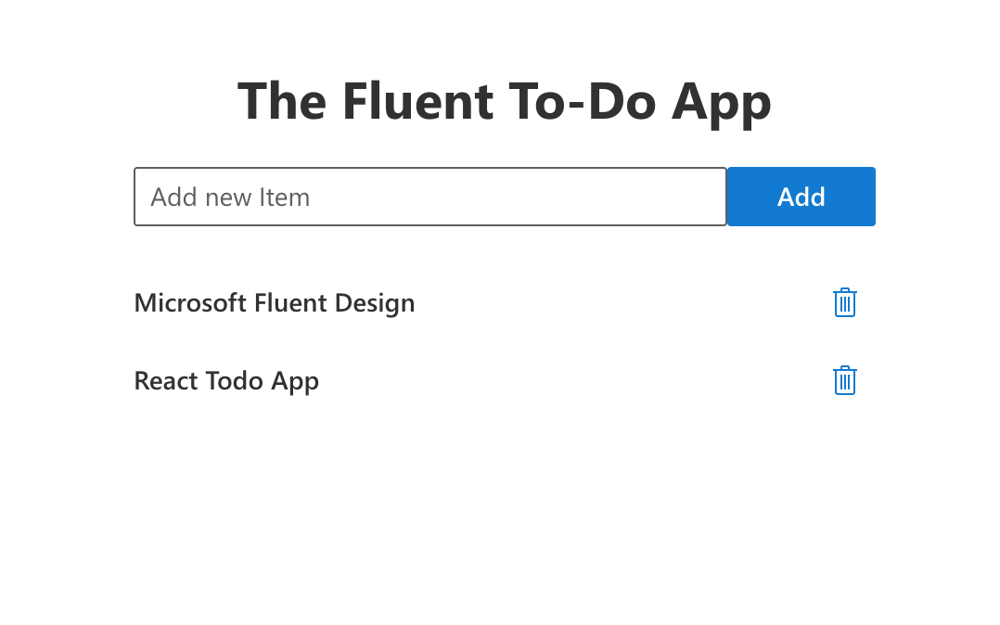
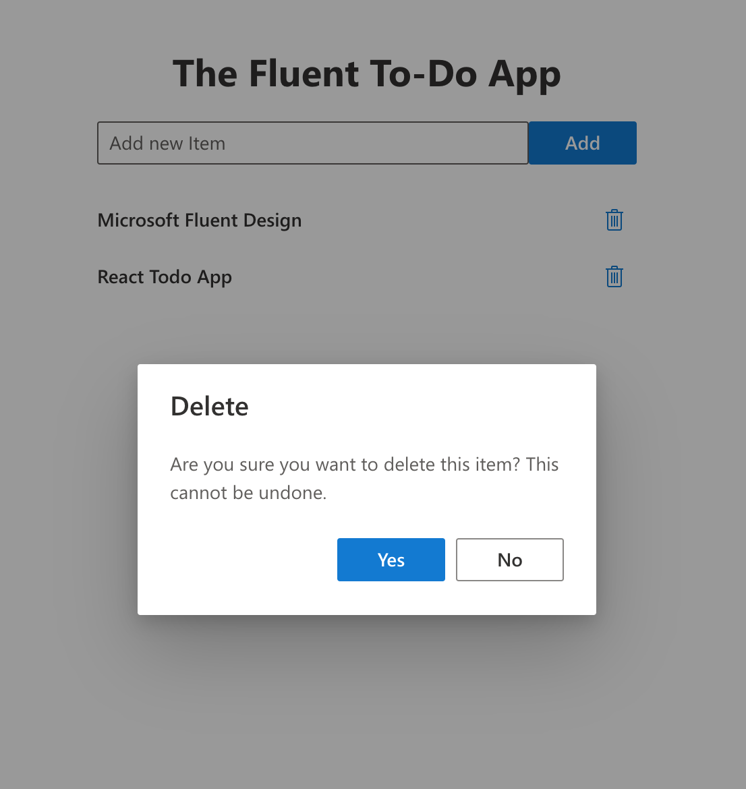

# ToDo App made in React with Microsoft Fluent Design

Links:
[Microsoft FluentUI Design](https://developer.microsoft.com/en-us/fluentui#/)

### In the project directory, you can run:

#### `npm install`

#### `npm start`

---

---
